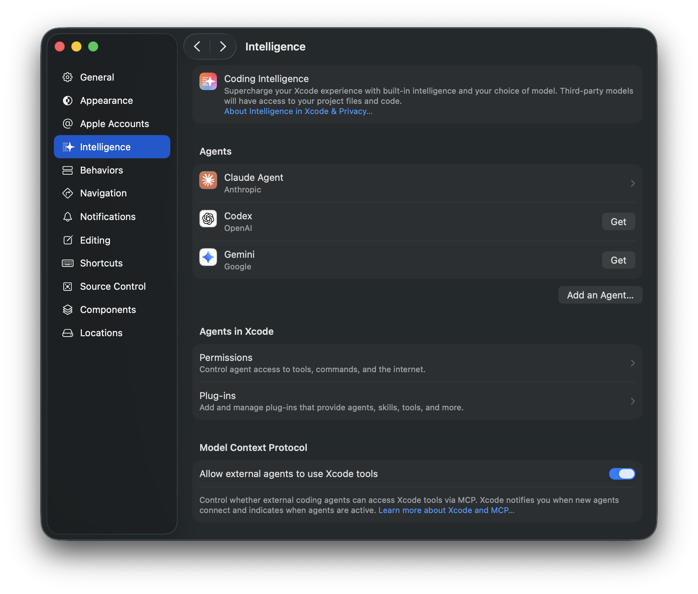

# Xcode Tools Documentation

A comprehensive reference for the Xcode MCP Server aka Xcode Tools. These tools enable AI assistants to interact with Xcode workspaces — managing files, building projects, running tests, rendering previews, and more.

> Reflects **Xcode 27 beta 1**.

<p align="center">
  
</p>

## Apple Documentation

- [Setting up coding intelligence](https://developer.apple.com/documentation/xcode/setting-up-coding-intelligence)
- [Writing code with intelligence in Xcode](https://developer.apple.com/documentation/xcode/writing-code-with-intelligence-in-xcode)
- [Giving agentic coding tools access to Xcode](https://developer.apple.com/documentation/xcode/giving-agentic-coding-tools-access-to-xcode)

## Prerequisites

- Xcode 27.0+ installed and running with an open workspace
- MCP server configured with Xcode integration

> **Note:** Most tools require a `tabIdentifier` parameter that identifies which Xcode workspace tab to operate on.

## Installation

Add the Xcode MCP server to your coding tool via `xcrun mcpbridge`:

**Claude Code:**
```bash
claude mcp add --transport stdio xcode -- xcrun mcpbridge
```

**Codex:**
```bash
codex mcp add xcode -- xcrun mcpbridge
```

Verify with `claude mcp list` or `codex mcp list`.

## Schema

[tools.json](tools.json) contains the full MCP tool definitions (name, title, description, input/output schemas) generated directly from `xcrun mcpbridge`.

## Xcode 27 beta 1 changes

> 🆕 marks tools added in **Xcode 27 beta 1**.

- **Renamed:** `ExecuteSnippet` → [`RunCodeSnippet`](#runcodesnippet) (gained a required `purpose` parameter)
- **Added:** scheme/run-destination management, project configuration (entitlements, Info.plist, build settings, per-file compiler flags), running & debugging on the active scheme, device interaction, crash & field performance reporting, and String Catalog/localization tools — see sections marked 🆕 below

## Table of Contents

- **[Workspace](#workspace)**
  - [XcodeListWindows](#xcodelistwindows)
  - [XcodeGetCurrentFile](#xcodegetcurrentfile) 🆕
  - [XcodeListSchemes](#xcodelistschemes) 🆕
  - [XcodeSwitchScheme](#xcodeswitchscheme) 🆕
  - [XcodeListRunDestinations](#xcodelistrundestinations) 🆕
  - [XcodeSwitchRunDestination](#xcodeswitchrundestination) 🆕
- **[File Operations](#file-operations)**
  - [XcodeLS](#xcodels)
  - [XcodeGlob](#xcodeglob)
  - [XcodeGrep](#xcodegrep)
  - [XcodeRead](#xcoderead)
  - [XcodeWrite](#xcodewrite)
  - [XcodeUpdate](#xcodeupdate)
  - [XcodeMakeDir](#xcodemakedir)
  - [XcodeMV](#xcodemv)
  - [XcodeRM](#xcoderm)
- **[Project Configuration](#project-configuration)** 🆕
  - [AddEntitlement](#addentitlement) 🆕
  - [AddInfoPlist](#addinfoplist) 🆕
  - [GetTargetBuildSettings](#gettargetbuildsettings) 🆕
  - [UpdateTargetBuildSetting](#updatetargetbuildsetting) 🆕
  - [GetFileCompilerFlags](#getfilecompilerflags) 🆕
  - [UpdateFileCompilerFlags](#updatefilecompilerflags) 🆕
- **[Build & Run](#build--run)**
  - [BuildProject](#buildproject)
  - [GetBuildLog](#getbuildlog)
  - [RunCodeSnippet](#runcodesnippet) (renamed from `ExecuteSnippet`)
  - [RunProject](#runproject) 🆕
  - [StopProject](#stopproject) 🆕
  - [GetConsoleOutput](#getconsoleoutput) 🆕
  - [InvokeDebuggerCommand](#invokedebuggercommand) 🆕
- **[Testing](#testing)**
  - [GetTestList](#gettestlist)
  - [RunAllTests](#runalltests)
  - [RunSomeTests](#runsometests)
- **[Diagnostics](#diagnostics)**
  - [XcodeRefreshCodeIssuesInFile](#xcoderefreshcodeissuesinfile)
  - [XcodeListNavigatorIssues](#xcodelistnavigatorissues)
- **[Device Interaction](#device-interaction)** 🆕
  - [DeviceInteractionStartSession](#deviceinteractionstartsession) 🆕
  - [DeviceInteractionInstallAndRun](#deviceinteractioninstallandrun) 🆕
  - [DeviceInteractionSynthesize](#deviceinteractionsynthesize) 🆕
  - [DeviceInteractionEndSession](#deviceinteractionendsession) 🆕
- **[Crash & Performance Reports](#crash--performance-reports)** 🆕
  - [GetTopCrashIssues](#gettopcrashissues) 🆕
  - [GetCrashIssueLogs](#getcrashissuelogs) 🆕
  - [GetTopFieldPerformanceIssues](#gettopfieldperformanceissues) 🆕
  - [GetFieldPerformanceIssueLogs](#getfieldperformanceissuelogs) 🆕
- **[Localization](#localization)** 🆕
  - [StringCatalogRead](#stringcatalogread) 🆕
  - [StringCatalogContext](#stringcatalogcontext) 🆕
  - [StringCatalogEdit](#stringcatalogedit) 🆕
  - [LocalizationPlanner](#localizationplanner) 🆕
- **[Preview](#preview)**
  - [RenderPreview](#renderpreview)
- **[Documentation](#documentation)**
  - [DocumentationSearch](#documentationsearch)

---

## Workspace

### XcodeListWindows

Lists current Xcode windows and their workspace information. Use this to obtain `tabIdentifier` values needed by all other tools.

**Parameters:** None

**Example:**
```
XcodeListWindows()
```

### XcodeGetCurrentFile 🆕

Gets information about the currently active file in the Xcode editor, including file path, content, and selection. Returns content in `cat -n` format.

| Parameter | Type | Required | Description |
|-----------|------|----------|-------------|
| `tabIdentifier` | string | Yes | Workspace tab identifier |
| `includeContent` | boolean | No | Include file content in the response |
| `includeSelection` | boolean | No | Include current selection information |
| `offset` | integer | No | Line number to start reading from |
| `limit` | integer | No | Number of lines to read (default: up to 600) |

**Example:**
```
XcodeGetCurrentFile(tabIdentifier: "...", includeSelection: true)
```

### XcodeListSchemes 🆕

Lists all schemes in the workspace and identifies the active one, including sharing status and container project. Inline results are capped at 100 (active scheme first); the full list is written to `fullSchemeListPath`.

| Parameter | Type | Required | Description |
|-----------|------|----------|-------------|
| `tabIdentifier` | string | Yes | Workspace tab identifier |

**Example:**
```
XcodeListSchemes(tabIdentifier: "...")
```

### XcodeSwitchScheme 🆕

Changes the active scheme. Use `XcodeListSchemes` to discover scheme names — pass the disambiguated name when multiple schemes share a name. May also adjust the active run destination automatically.

| Parameter | Type | Required | Description |
|-----------|------|----------|-------------|
| `tabIdentifier` | string | Yes | Workspace tab identifier |
| `schemeName` | string | Yes | Name (or disambiguated name) of the scheme to activate |

**Example:**
```
XcodeSwitchScheme(tabIdentifier: "...", schemeName: "MyApp")
```

### XcodeListRunDestinations 🆕

Lists run destinations for the active scheme, grouped like the Xcode picker (Devices, Simulators, Build, Incompatible, etc.) and identifies the active one. Inline results are capped at 40 (active destination first, "Incompatible" omitted by default); the full list is written to `fullRunDestinationListPath`.

| Parameter | Type | Required | Description |
|-----------|------|----------|-------------|
| `tabIdentifier` | string | Yes | Workspace tab identifier |
| `includeIncompatible` | boolean | No | Include "Incompatible" destinations inline. Default: `false` |

**Example:**
```
XcodeListRunDestinations(tabIdentifier: "...")
```

### XcodeSwitchRunDestination 🆕

Changes the active run destination for the active scheme (the scheme itself is left unchanged). Pass the destination's `displayTitle`, sourced from `XcodeListRunDestinations`, `XcodeSwitchScheme`, or this tool's own output.

| Parameter | Type | Required | Description |
|-----------|------|----------|-------------|
| `tabIdentifier` | string | Yes | Workspace tab identifier |
| `displayTitle` | string | Yes | Destination's disambiguated display title, as shown in the Xcode picker |

**Example:**
```
XcodeSwitchRunDestination(tabIdentifier: "...", displayTitle: "iPhone 17 Pro")
```

---

## File Operations

### XcodeLS

Lists files and directories in the Xcode project structure at a given path. Operates on the project navigator hierarchy, not the filesystem.

| Parameter | Type | Required | Description |
|-----------|------|----------|-------------|
| `tabIdentifier` | string | Yes | Workspace tab identifier |
| `path` | string | Yes | Project path to browse (e.g., `ProjectName/Sources/`) |
| `recursive` | boolean | No | List all files recursively (truncated at 100 lines). Default: `true` |
| `ignore` | string[] | No | Patterns to skip |

**Example:**
```
XcodeLS(tabIdentifier: "...", path: "MyApp/Sources/")
```

### XcodeGlob

Finds files in the Xcode project matching wildcard patterns. Supports `*`, `**`, `?`, `[abc]`, and `{swift,m}` syntax.

| Parameter | Type | Required | Description |
|-----------|------|----------|-------------|
| `tabIdentifier` | string | Yes | Workspace tab identifier |
| `pattern` | string | No | Glob pattern (e.g., `**/*.swift`). Defaults to `**/*` |
| `path` | string | No | Directory to search in (defaults to project root) |

**Example:**
```
XcodeGlob(tabIdentifier: "...", pattern: "**/*.swift")
```

### XcodeGrep

Searches file contents using regex patterns within the Xcode project structure.

| Parameter | Type | Required | Description |
|-----------|------|----------|-------------|
| `tabIdentifier` | string | Yes | Workspace tab identifier |
| `pattern` | string | Yes | Regex pattern to search for |
| `path` | string | No | File or directory to search in (defaults to root) |
| `glob` | string | No | Only search files matching this glob |
| `type` | string | No | File type shortcut (`swift`, `js`, `py`, etc.) |
| `outputMode` | string | No | `content`, `filesWithMatches` (default), or `count` |
| `ignoreCase` | boolean | No | Case-insensitive matching |
| `multiline` | boolean | No | Allow patterns to span multiple lines |
| `showLineNumbers` | boolean | No | Show line numbers (content mode only) |
| `linesBefore` | integer | No | Context lines before each match |
| `linesAfter` | integer | No | Context lines after each match |
| `linesContext` | integer | No | Context lines before and after each match |
| `headLimit` | integer | No | Stop after N results |

**Example:**
```
XcodeGrep(
  tabIdentifier: "...",
  pattern: "func viewDidLoad",
  type: "swift",
  outputMode: "content",
  linesAfter: 5
)
```

### XcodeRead

Reads file contents with line numbers (`cat -n` format). Supports offset/limit for large files.

| Parameter | Type | Required | Description |
|-----------|------|----------|-------------|
| `tabIdentifier` | string | Yes | Workspace tab identifier |
| `filePath` | string | Yes | Project-relative file path (e.g., `ProjectName/Sources/MyFile.swift`) |
| `offset` | integer | No | Line number to start reading from |
| `limit` | integer | No | Number of lines to read (default: up to 600) |

**Example:**
```
XcodeRead(tabIdentifier: "...", filePath: "MyApp/Sources/ContentView.swift")
```

### XcodeWrite

Creates or overwrites files in the Xcode project. Automatically adds new files to the project structure.

| Parameter | Type | Required | Description |
|-----------|------|----------|-------------|
| `tabIdentifier` | string | Yes | Workspace tab identifier |
| `filePath` | string | Yes | Project-relative file path |
| `content` | string | Yes | File content to write |

**Example:**
```
XcodeWrite(
  tabIdentifier: "...",
  filePath: "MyApp/Sources/NewFeature.swift",
  content: "import Foundation\n\nstruct NewFeature {\n}\n"
)
```

### XcodeUpdate

Edits files by finding and replacing text. Operates on project structure paths.

| Parameter | Type | Required | Description |
|-----------|------|----------|-------------|
| `tabIdentifier` | string | Yes | Workspace tab identifier |
| `filePath` | string | Yes | Project-relative file path |
| `oldString` | string | Yes | Text to find |
| `newString` | string | Yes | Replacement text (must differ from `oldString`) |
| `replaceAll` | boolean | No | Replace all occurrences. Default: `false` |

**Example:**
```
XcodeUpdate(
  tabIdentifier: "...",
  filePath: "MyApp/Sources/ContentView.swift",
  oldString: "Hello, World!",
  newString: "Hello, SwiftUI!"
)
```

### XcodeMakeDir

Creates directories and groups in the Xcode project navigator.

| Parameter | Type | Required | Description |
|-----------|------|----------|-------------|
| `tabIdentifier` | string | Yes | Workspace tab identifier |
| `directoryPath` | string | Yes | Project-relative path for the new directory |

**Example:**
```
XcodeMakeDir(tabIdentifier: "...", directoryPath: "MyApp/Sources/ViewModels")
```

### XcodeMV

Moves, copies, or renames files and directories in the project navigator.

| Parameter | Type | Required | Description |
|-----------|------|----------|-------------|
| `tabIdentifier` | string | Yes | Workspace tab identifier |
| `sourcePath` | string | Yes | Source path in project navigator |
| `destinationPath` | string | Yes | Destination path or new name |
| `operation` | string | No | `move` or `copy` |
| `overwriteExisting` | boolean | No | Overwrite files at destination |

**Example:**
```
XcodeMV(
  tabIdentifier: "...",
  sourcePath: "MyApp/Sources/OldName.swift",
  destinationPath: "MyApp/Sources/NewName.swift"
)
```

### XcodeRM

Removes files and directories from the Xcode project. Optionally deletes underlying filesystem files.

| Parameter | Type | Required | Description |
|-----------|------|----------|-------------|
| `tabIdentifier` | string | Yes | Workspace tab identifier |
| `path` | string | Yes | Project path to remove |
| `recursive` | boolean | No | Remove directories and contents recursively |
| `deleteFiles` | boolean | No | Also move files to Trash. Default: `true` |

**Example:**
```
XcodeRM(tabIdentifier: "...", path: "MyApp/Sources/Deprecated.swift")
```

---

## Project Configuration 🆕

### AddEntitlement 🆕

Adds an entitlement to the project's entitlements file. Reserve this for restricted system capabilities — App Groups, Push Notifications, iCloud, paid transactions, privileged IPC, etc. Not for standard frameworks (SwiftUI, MapKit, CoreLocation...) or Info.plist privacy strings — use `AddInfoPlist` for those.

| Parameter | Type | Required | Description |
|-----------|------|----------|-------------|
| `tabIdentifier` | string | Yes | Workspace tab identifier |
| `targetName` | string | Yes | Target to add the entitlement to |
| `entitlementKey` | string | Yes | Entitlement key |
| `entitlementValueType` | string | Yes | `bool`, `string`, `int`, `stringArray`, or `dictionary` |
| `entitlementValue` | string | No | Value for `bool`/`string`/`int` types (`"true"`/`"false"` for bool) |
| `entitlementValueItems` | string[] | No | Values for `stringArray` type |
| `entitlementDictionaryItems` | string | No | JSON-encoded dictionary for `dictionary` type |

**Example:**
```
AddEntitlement(
  tabIdentifier: "...",
  targetName: "MyApp",
  entitlementKey: "com.apple.security.application-groups",
  entitlementValueType: "stringArray",
  entitlementValueItems: ["group.com.example.myapp"]
)
```

### AddInfoPlist 🆕

Adds or updates an Info.plist key — privacy usage descriptions, App Transport Security, supported orientations, URL schemes, background modes, bundle metadata, etc. Not for entitlements — use `AddEntitlement` for restricted system capabilities.

| Parameter | Type | Required | Description |
|-----------|------|----------|-------------|
| `tabIdentifier` | string | Yes | Workspace tab identifier |
| `targetName` | string | Yes | Target to add the key to |
| `infoPlistKey` | string | Yes | Info.plist key (e.g., `NSCameraUsageDescription`) |
| `infoPlistValueType` | string | Yes | `bool`, `string`, `int`, `stringArray`, or `dictionaryArray` |
| `infoPlistValue` | string | No | Value for `bool`/`string`/`int` types (`"true"`/`"false"` for bool) |
| `infoPlistValueItems` | string[] | No | Values for `stringArray` type |
| `infoPlistDictionaryItems` | string | No | JSON-encoded array of dictionaries for `dictionaryArray` type |

**Example:**
```
AddInfoPlist(
  tabIdentifier: "...",
  targetName: "MyApp",
  infoPlistKey: "NSCameraUsageDescription",
  infoPlistValueType: "string",
  infoPlistValue: "Used to scan documents"
)
```

### GetTargetBuildSettings 🆕

Gets all build settings for an Xcode target. Use this rather than reading `project.pbxproj` directly.

| Parameter | Type | Required | Description |
|-----------|------|----------|-------------|
| `tabIdentifier` | string | Yes | Workspace tab identifier |
| `targetName` | string | Yes | Target name |

**Example:**
```
GetTargetBuildSettings(tabIdentifier: "...", targetName: "MyApp")
```

### UpdateTargetBuildSetting 🆕

Updates, appends to, or deletes a build setting on a target. Omit `buildSettingValue` to delete the setting. Use this rather than modifying `project.pbxproj` directly.

| Parameter | Type | Required | Description |
|-----------|------|----------|-------------|
| `tabIdentifier` | string | Yes | Workspace tab identifier |
| `targetName` | string | Yes | Target name |
| `buildSettingName` | string | Yes | Build setting name |
| `buildSettingValue` | string | No | New value (omit to delete the setting; don't convert `"NO"` to `"false"`) |
| `appendValue` | boolean | No | Append to the existing value instead of replacing it |

**Example:**
```
UpdateTargetBuildSetting(
  tabIdentifier: "...",
  targetName: "MyApp",
  buildSettingName: "SWIFT_VERSION",
  buildSettingValue: "6.0"
)
```

### GetFileCompilerFlags 🆕

Gets the per-file compiler flags for a source file in a target — the value shown in the Compiler Flags column of Target > Build Phases > Compile Sources. Returns an empty string when none are set. Note: flags on `.swift` files often don't affect builds, since Swift compiles per-module — prefer `OTHER_SWIFT_FLAGS` at the target level.

| Parameter | Type | Required | Description |
|-----------|------|----------|-------------|
| `tabIdentifier` | string | Yes | Workspace tab identifier |
| `targetName` | string | Yes | Target whose build phase contains the file |
| `filePath` | string | Yes | Project-relative path to the source file |
| `projectPath` | string | No | Path to the owning `.xcodeproj`; only needed when the target name is ambiguous |

**Example:**
```
GetFileCompilerFlags(tabIdentifier: "...", targetName: "MyApp", filePath: "MyApp/Sources/Legacy.m")
```

### UpdateFileCompilerFlags 🆕

Updates, appends to, or deletes the per-file compiler flags for a source file. Use sparingly — prefer `UpdateTargetBuildSetting` unless a flag truly must apply to a single file (e.g. incrementally adopting `-fbounds-safety`). Note: flags on `.swift` files typically don't affect builds — prefer `OTHER_SWIFT_FLAGS` at the target level.

| Parameter | Type | Required | Description |
|-----------|------|----------|-------------|
| `tabIdentifier` | string | Yes | Workspace tab identifier |
| `targetName` | string | Yes | Target whose build phase contains the file |
| `filePath` | string | Yes | Project-relative path to the source file |
| `compilerFlags` | string | No | Space-separated flags (e.g. `"-DFOO=1 -Wno-unused-variable"`); omit to delete all |
| `appendValue` | boolean | No | Append to existing flags (space-separated) instead of replacing |
| `projectPath` | string | No | Path to the owning `.xcodeproj`; only needed when the target name is ambiguous |

**Example:**
```
UpdateFileCompilerFlags(
  tabIdentifier: "...",
  targetName: "MyApp",
  filePath: "MyApp/Sources/Legacy.m",
  compilerFlags: "-fno-objc-arc"
)
```

---

## Build & Run

### BuildProject

Builds the Xcode project using the active scheme and waits for completion.

| Parameter | Type | Required | Description |
|-----------|------|----------|-------------|
| `tabIdentifier` | string | Yes | Workspace tab identifier |

**Example:**
```
BuildProject(tabIdentifier: "...")
```

### GetBuildLog

Retrieves build log entries from the current or most recent build. Filter by severity, file pattern, or message regex.

| Parameter | Type | Required | Description |
|-----------|------|----------|-------------|
| `tabIdentifier` | string | Yes | Workspace tab identifier |
| `severity` | string | No | Minimum severity: `error` (default), `warning`, or `remark` |
| `pattern` | string | No | Regex to filter by message, task description, command line, or console output |
| `glob` | string | No | Glob to filter by file path or task location |

**Example:**
```
GetBuildLog(tabIdentifier: "...", severity: "warning")
```

### RunCodeSnippet

> Renamed from `ExecuteSnippet` in Xcode 27 beta 1, and gained a required `purpose` parameter.

Builds and runs a code snippet in the context of a specific source file and waits for the result. The snippet has access to all declarations in that file, including `fileprivate` ones. Output comes from `print` statements. Only works with source files in targets that build apps, frameworks, libraries, or CLI executables.

| Parameter | Type | Required | Description |
|-----------|------|----------|-------------|
| `tabIdentifier` | string | Yes | Workspace tab identifier |
| `codeSnippet` | string | Yes | Swift code to execute |
| `sourceFilePath` | string | Yes | Project-relative path to the context file |
| `purpose` | string | Yes | Short human-readable description of why the snippet is being run (avoid the word "test" — this isn't related to testing) |
| `timeout` | integer | No | Max wait time in seconds. Default: 600 |

**Example:**
```
RunCodeSnippet(
  tabIdentifier: "...",
  sourceFilePath: "MyApp/Sources/Models/User.swift",
  codeSnippet: "let user = User(name: \"Test\")\nprint(user)",
  purpose: "Inspect the default User description"
)
```

### RunProject 🆕

Builds and runs the active scheme — equivalent to pressing Run (Cmd+R). Returns once the app has launched and is running.

| Parameter | Type | Required | Description |
|-----------|------|----------|-------------|
| `tabIdentifier` | string | Yes | Workspace tab identifier |
| `attachDebugger` | boolean | No | Attach the debugger to the launched process. Default: `false` |

> Use `InvokeDebuggerCommand` to debug (with `attachDebugger: true`), `GetConsoleOutput` to read logs, and `StopProject` to stop the app when finished.

**Example:**
```
RunProject(tabIdentifier: "...", attachDebugger: true)
```

### StopProject 🆕

Stops the currently running app — equivalent to pressing Stop (Cmd+.). Reports that there's nothing to stop if no app is running.

| Parameter | Type | Required | Description |
|-----------|------|----------|-------------|
| `tabIdentifier` | string | Yes | Workspace tab identifier |

**Example:**
```
StopProject(tabIdentifier: "...")
```

### GetConsoleOutput 🆕

Retrieves stdout, stderr, and OSLog output from a running or completed app launch session, with regex, severity, and context-line filtering.

| Parameter | Type | Required | Description |
|-----------|------|----------|-------------|
| `tabIdentifier` | string | Yes | Workspace tab identifier |
| `launchSessionReference` | string | No | Launch session to read from. Defaults to the current/most recent session |
| `outputType` | string | No | `stdio`, `oslog`, or `all` (default) |
| `oslogSeverity` | string[] | No | Filter OSLog by severity: `error`, `fault`, `info`, `debug`, `default` |
| `pattern` | string | No | Regex to filter stdout/stderr text and OSLog messages |
| `contextLines` | integer | No | Context lines around pattern matches (like `grep -C`). Default: `0` |
| `includeMetadata` | boolean | No | Include OSLog metadata (subsystem, category, pid, tid, sender). Default: `false` |
| `tailLimit` | integer | No | Max lines to return from the end of the output. Default: `500` |

**Example:**
```
GetConsoleOutput(tabIdentifier: "...", outputType: "oslog", oslogSeverity: ["error", "fault"])
```

### InvokeDebuggerCommand 🆕

Sends an lldb command to Xcode's active debugging session and returns the output. The process must already be running with the debugger attached (e.g. via `RunProject(attachDebugger: true)`). The command runs in the same lldb session as Xcode's debug console.

| Parameter | Type | Required | Description |
|-----------|------|----------|-------------|
| `tabIdentifier` | string | Yes | Workspace tab identifier |
| `command` | string | Yes | lldb command (e.g. `bt`, `po self`, `breakpoint set -n viewDidLoad`, `continue`, `thread step-over`, `frame variable`) |
| `timeout` | integer | No | Max seconds to wait. Default: `30` (increase for commands that resume execution, like `continue`) |

**Example:**
```
InvokeDebuggerCommand(tabIdentifier: "...", command: "po self.viewModel")
```

---

## Testing

### GetTestList

Gets all available tests from the active scheme's active test plan. Results are limited to 100 tests. The complete list is written to `fullTestListPath` in grep-friendly format — use grep with keys like `TEST_TARGET`, `TEST_IDENTIFIER`, or `TEST_FILE_PATH` to find specific tests.

| Parameter | Type | Required | Description |
|-----------|------|----------|-------------|
| `tabIdentifier` | string | Yes | Workspace tab identifier |

**Example:**
```
GetTestList(tabIdentifier: "...")
```

### RunAllTests

Runs every test in the active scheme's active test plan.

| Parameter | Type | Required | Description |
|-----------|------|----------|-------------|
| `tabIdentifier` | string | Yes | Workspace tab identifier |

**Example:**
```
RunAllTests(tabIdentifier: "...")
```

### RunSomeTests

Runs specific tests by target and identifier. Use `GetTestList` first to discover available test identifiers.

| Parameter | Type | Required | Description |
|-----------|------|----------|-------------|
| `tabIdentifier` | string | Yes | Workspace tab identifier |
| `tests` | array | Yes | Array of test specifiers (see below) |

Each test specifier object:

| Field | Type | Required | Description |
|-------|------|----------|-------------|
| `targetName` | string | Yes | Test target name |
| `testIdentifier` | string | Yes | Test identifier in XCTestIdentifier format |

**Example:**
```
RunSomeTests(
  tabIdentifier: "...",
  tests: [
    { "targetName": "MyAppTests", "testIdentifier": "MyAppTests/LoginTests/testValidLogin" }
  ]
)
```

---

## Diagnostics

### XcodeRefreshCodeIssuesInFile

Retrieves current compiler diagnostics (errors, warnings, notes) for a specific file.

| Parameter | Type | Required | Description |
|-----------|------|----------|-------------|
| `tabIdentifier` | string | Yes | Workspace tab identifier |
| `filePath` | string | Yes | Project-relative file path |

**Example:**
```
XcodeRefreshCodeIssuesInFile(
  tabIdentifier: "...",
  filePath: "MyApp/Sources/ContentView.swift"
)
```

### XcodeListNavigatorIssues

Lists issues from Xcode's Issue Navigator, including build errors, package resolution problems, and workspace configuration issues.

| Parameter | Type | Required | Description |
|-----------|------|----------|-------------|
| `tabIdentifier` | string | Yes | Workspace tab identifier |
| `severity` | string | No | Minimum severity: `error` (default), `warning`, or `remark` |
| `pattern` | string | No | Regex to filter by message |
| `glob` | string | No | Glob to filter by file path |

**Example:**
```
XcodeListNavigatorIssues(tabIdentifier: "...", severity: "warning")
```

---

## Device Interaction 🆕

Tools for driving a simulator or physical device — booting it, installing and launching the app, and synthesizing UI events. Sessions are expensive to keep open: start one early (in parallel with other work) and always close it with `DeviceInteractionEndSession` when done.

### DeviceInteractionStartSession 🆕

Prepares a runtime for device interaction — finds and, if necessary, boots the target device. Call this as early as possible if device interaction will be needed; do not call it if the app cannot be built and installed on an iOS device.

| Parameter | Type | Required | Description |
|-----------|------|----------|-------------|
| `tabIdentifier` | string | Yes | Workspace tab identifier |
| `sessionIdentifier` | string | Yes | Unique, human-friendly session name in Title Case (e.g. "Verify Login Flow"), used in logs and UI |
| `deviceIdentifier` | string | No | UUID/ECID/name/OS version/type to match against — the best candidate is selected |

**Example:**
```
DeviceInteractionStartSession(tabIdentifier: "...", sessionIdentifier: "Verify Login Flow")
```

### DeviceInteractionInstallAndRun 🆕

Builds, installs, and starts the app on the currently targeted device. Call again whenever you modify the project, change the target device, or lose the debug session and need fresh logs.

| Parameter | Type | Required | Description |
|-----------|------|----------|-------------|
| `tabIdentifier` | string | Yes | Workspace tab identifier |
| `interactionSessionKey` | string | Yes | Session key from `DeviceInteractionStartSession` |
| `commandLineArguments` | string[] | No | Launch arguments; may include `$(inherited)` for scheme-provided arguments |
| `environmentVariables` | object | No | Launch environment variables; may include `$(inherited)` as a key for scheme-provided variables |

**Example:**
```
DeviceInteractionInstallAndRun(tabIdentifier: "...", interactionSessionKey: "...")
```

### DeviceInteractionSynthesize 🆕

Synthesizes device events — tap, swipe, type, button press, orientation change — and captures the resulting screenshot and UI hierarchy. Always derive coordinates from the latest hierarchy dump; never guess positions from a screenshot alone.

| Parameter | Type | Required | Description |
|-----------|------|----------|-------------|
| `interactSessionKey` | string | Yes | Session key from `DeviceInteractionStartSession` |
| `interactionCommand` | string | Yes | Interaction command to run (e.g. `t 100 200` to tap at that point) |

**Example:**
```
DeviceInteractionSynthesize(interactSessionKey: "...", interactionCommand: "t 100 200")
```

### DeviceInteractionEndSession 🆕

Closes a session opened with `DeviceInteractionStartSession`. Always call this once interaction is finished — keeping a session alive is expensive and affects the user-facing UI.

| Parameter | Type | Required | Description |
|-----------|------|----------|-------------|
| `interactionSessionKey` | string | Yes | Session key to close |

**Example:**
```
DeviceInteractionEndSession(interactionSessionKey: "...")
```

---

## Crash & Performance Reports 🆕

Tools for querying Apple's crash reporting and field performance data for a shipped app. `bundle_id` and `platform` auto-resolve from the active scheme/run destination when omitted.

### GetTopCrashIssues 🆕

Returns the top crash signatures for an app over the last 14 days, sorted by the number of unique devices affected. Use this to identify and prioritize the most impactful crashes.

| Parameter | Type | Required | Description |
|-----------|------|----------|-------------|
| `tabIdentifier` | string | Yes | Workspace tab identifier |
| `bundle_id` | string | No | App bundle identifier (case-sensitive). Auto-resolved from the active scheme's target if omitted |
| `platform` | string | No | `iOS`, `macOS`, `watchOS`, `tvOS`, or `visionOS`. Auto-resolved from the active run destination if omitted |
| `app_version` | string | No | Filter to a specific version (e.g. `4.6`). Returns all versions if omitted |
| `is_beta` | boolean | No | TestFlight (`true`) or App Store (`false`) data. Both channels if omitted |
| `count` | integer | No | Number of signatures to return. Use `1` for "top crash" (singular). Default: `5` |

**Example:**
```
GetTopCrashIssues(tabIdentifier: "...", count: 1)
```

### GetCrashIssueLogs 🆕

Gets detailed crash logs, expert triage knowledge, and actionable recommendations for a specific crash signature. Use after `GetTopCrashIssues` to drill into a signature.

| Parameter | Type | Required | Description |
|-----------|------|----------|-------------|
| `tabIdentifier` | string | Yes | Workspace tab identifier |
| `signature_name` | string | Yes | Human-readable crash signature name from `GetTopCrashIssues` |
| `bundle_id` | string | No | App bundle identifier (case-sensitive). Auto-resolved if omitted |
| `platform` | string | No | Platform to query. Auto-resolved if omitted |
| `app_version` | string | No | Filter to a specific version. Returns all versions if omitted |
| `is_beta` | boolean | No | TestFlight (`true`) or App Store (`false`) data. Both channels if omitted |

**Example:**
```
GetCrashIssueLogs(tabIdentifier: "...", signature_name: "SIGABRT in UIViewController.viewDidLoad")
```

### GetTopFieldPerformanceIssues 🆕

Analyzes app performance and identifies regressions across diagnostic types — app launches, hangs, disk writes, or energy usage — using Apple's field report data.

| Parameter | Type | Required | Description |
|-----------|------|----------|-------------|
| `tabIdentifier` | string | Yes | Workspace tab identifier |
| `diagnostic_type` | string | Yes | `launches`, `hangs`, `diskwrites`, or `energy` |
| `bundle_id` | string | No | App bundle identifier (case-sensitive). Auto-resolved if omitted |
| `platform` | string | No | Platform to query (supported values depend on diagnostic type). Auto-resolved if omitted |
| `app_version` | string | No | App version (e.g. `4.6`). Lists available versions if omitted |
| `is_beta` | boolean | No | TestFlight (`true`) or App Store (`false`) data. Auto-detected from the version when possible |

**Example:**
```
GetTopFieldPerformanceIssues(tabIdentifier: "...", diagnostic_type: "hangs")
```

### GetFieldPerformanceIssueLogs 🆕

Gets detailed logs, performance data (stack traces, timeline data), and triage guidance for a specific field performance issue. Use after `GetTopFieldPerformanceIssues` to drill into a signature.

| Parameter | Type | Required | Description |
|-----------|------|----------|-------------|
| `tabIdentifier` | string | Yes | Workspace tab identifier |
| `app_version` | string | Yes | App version (e.g. `13.14.0`) |
| `signature_name` | string | Yes | Human-readable signature name from `GetTopFieldPerformanceIssues` |
| `diagnostic_type` | string | Yes | `launches`, `hangs`, `diskwrites`, or `energy` |
| `bundle_id` | string | No | App bundle identifier (case-sensitive). Auto-resolved if omitted |
| `platform` | string | No | Platform to query. Auto-resolved if omitted |
| `is_beta` | boolean | No | TestFlight (`true`) or App Store (`false`) data. Auto-detected from the version when possible |

**Example:**
```
GetFieldPerformanceIssueLogs(
  tabIdentifier: "...",
  app_version: "13.14.0",
  signature_name: "Slow launch on iPhone 13",
  diagnostic_type: "launches"
)
```

---

## Localization 🆕

> **Note:** These tools require activating the corresponding `xcode-integration:translation` (for `StringCatalogContext`/`StringCatalogEdit`) or `xcode-integration:translation-coordinator` (for `StringCatalogRead`/`LocalizationPlanner`) skill before use.

### StringCatalogRead 🆕

Returns string keys grouped by translation state for a locale in a String Catalog.

| Parameter | Type | Required | Description |
|-----------|------|----------|-------------|
| `tabIdentifier` | string | Yes | Workspace tab identifier |
| `filePath` | string | Yes | Path to the String Catalog |
| `targetLocaleIdentifier` | string | Yes | Locale identifier to check translations for |
| `requestedState` | string | No | Translation state to retrieve keys for |
| `offset` | integer | No | Number of keys to skip before returning results |
| `keyLimit` | integer | No | Maximum number of keys to return |

**Example:**
```
StringCatalogRead(
  tabIdentifier: "...",
  filePath: "MyApp/Resources/Localizable.xcstrings",
  targetLocaleIdentifier: "de"
)
```

### StringCatalogContext 🆕

Returns context and the source-language value for a string key — the text (`sourceValues`) that needs to be translated.

| Parameter | Type | Required | Description |
|-----------|------|----------|-------------|
| `tabIdentifier` | string | Yes | Workspace tab identifier |
| `filePath` | string | Yes | Path to the String Catalog |
| `stringKey` | string | Yes | String key to get context for |
| `targetLocaleIdentifier` | string | Yes | Locale identifier to translate into |

**Example:**
```
StringCatalogContext(
  tabIdentifier: "...",
  filePath: "MyApp/Resources/Localizable.xcstrings",
  stringKey: "welcome_message",
  targetLocaleIdentifier: "de"
)
```

### StringCatalogEdit 🆕

Inserts a translation for a locale into a String Catalog — a simple string, a template with plural/format substitutions, a top-level plural/device/width variation structure, or a string set.

| Parameter | Type | Required | Description |
|-----------|------|----------|-------------|
| `tabIdentifier` | string | Yes | Workspace tab identifier |
| `filePath` | string | Yes | Path to the String Catalog |
| `stringKey` | string | Yes | String key to translate |
| `targetLocaleIdentifier` | string | Yes | Locale identifier to insert the translation for |
| `translation` | string | No | Simple translation for non-varied strings |
| `templateTranslation` | object | No | Template + substitutions (for strings varied by plural/format) |
| `variationTranslation` | object | No | Top-level plural/device/width variation structure |
| `stringSetTranslation` | string[] | No | Translated values for string sets |

**Example:**
```
StringCatalogEdit(
  tabIdentifier: "...",
  filePath: "MyApp/Resources/Localizable.xcstrings",
  stringKey: "welcome_message",
  targetLocaleIdentifier: "de",
  translation: "Willkommen"
)
```

### LocalizationPlanner 🆕

Ensures the project is in a state where translations can be added for a locale. Call this every time you're asked to add a language to the project, or to localize an entire project.

| Parameter | Type | Required | Description |
|-----------|------|----------|-------------|
| `tabIdentifier` | string | Yes | Workspace tab identifier |
| `targetLocaleIdentifier` | string | Yes | Locale identifier to prepare the project for |

**Example:**
```
LocalizationPlanner(tabIdentifier: "...", targetLocaleIdentifier: "de")
```

---

## Preview

### RenderPreview

Builds and renders a SwiftUI preview, returning a snapshot of the resulting UI.

| Parameter | Type | Required | Description |
|-----------|------|----------|-------------|
| `tabIdentifier` | string | Yes | Workspace tab identifier |
| `sourceFilePath` | string | Yes | Project-relative path to the file containing the preview |
| `previewDefinitionIndexInFile` | integer | No | Zero-based index of the `#Preview` macro or `PreviewProvider` in the file. Default: `0` |
| `timeout` | integer | No | Max wait time in seconds. Default: 120 |

**Example:**
```
RenderPreview(
  tabIdentifier: "...",
  sourceFilePath: "MyApp/Sources/Views/ProfileView.swift"
)
```

---

## Documentation

### DocumentationSearch

Searches Apple Developer Documentation using semantic matching. Useful for looking up APIs, frameworks, and usage patterns.

| Parameter | Type | Required | Description |
|-----------|------|----------|-------------|
| `query` | string | Yes | Search query |
| `frameworks` | string[] | No | Limit search to specific frameworks. Searches all if omitted |

**Example:**
```
DocumentationSearch(query: "URLSession background download")
```

## Author

Artem Novichkov, https://artemnovichkov.com
